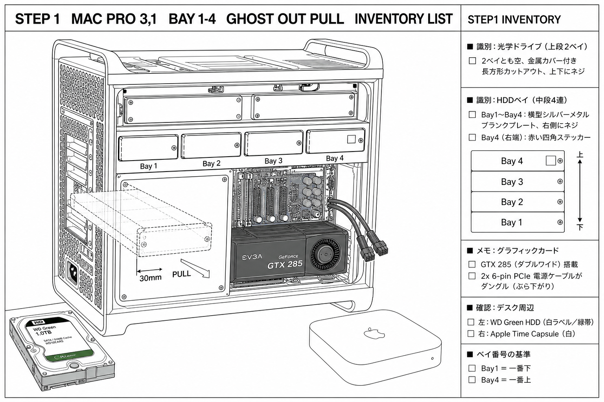
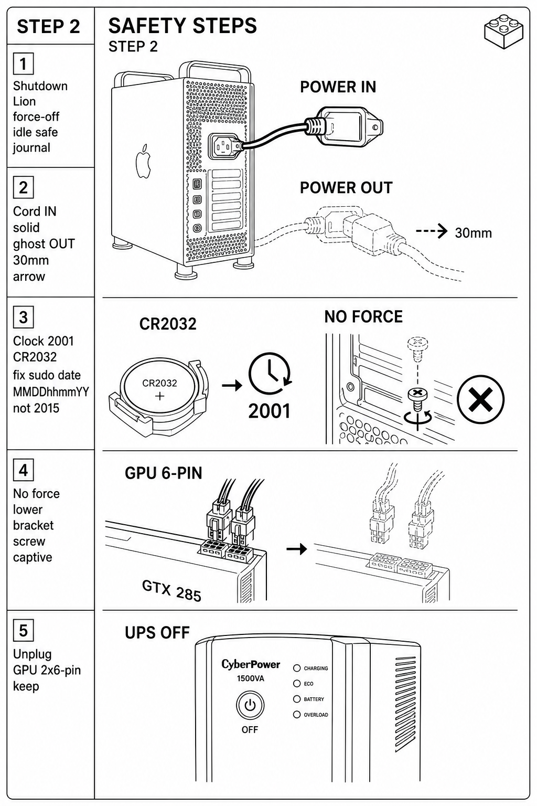
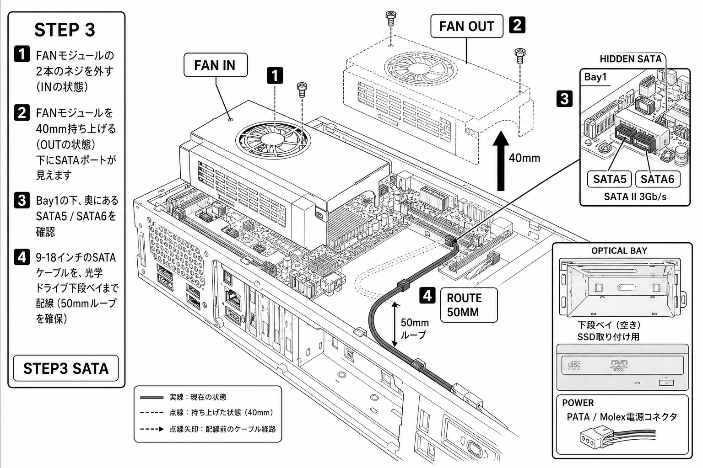
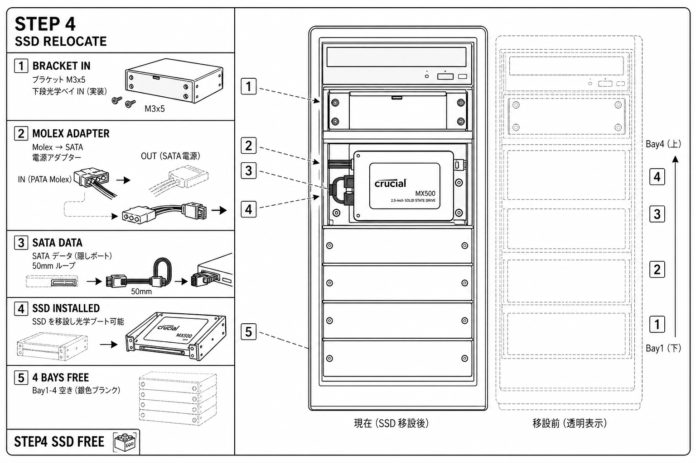
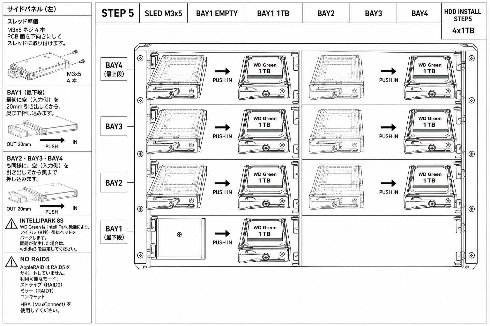
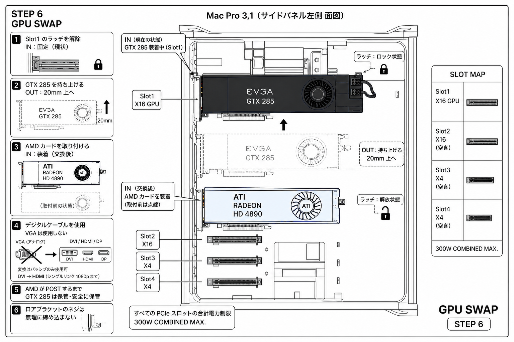
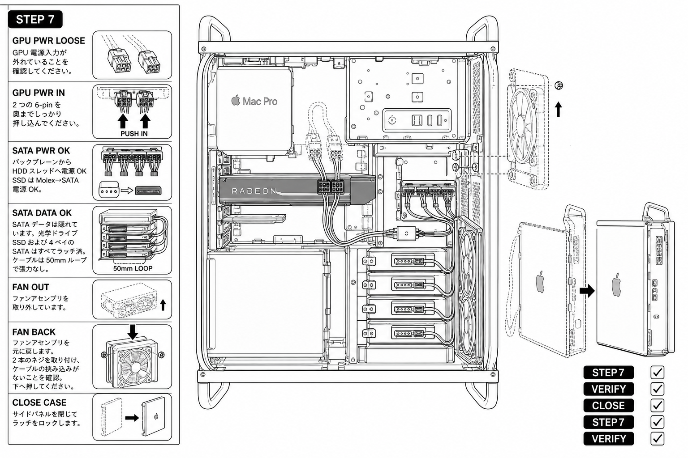
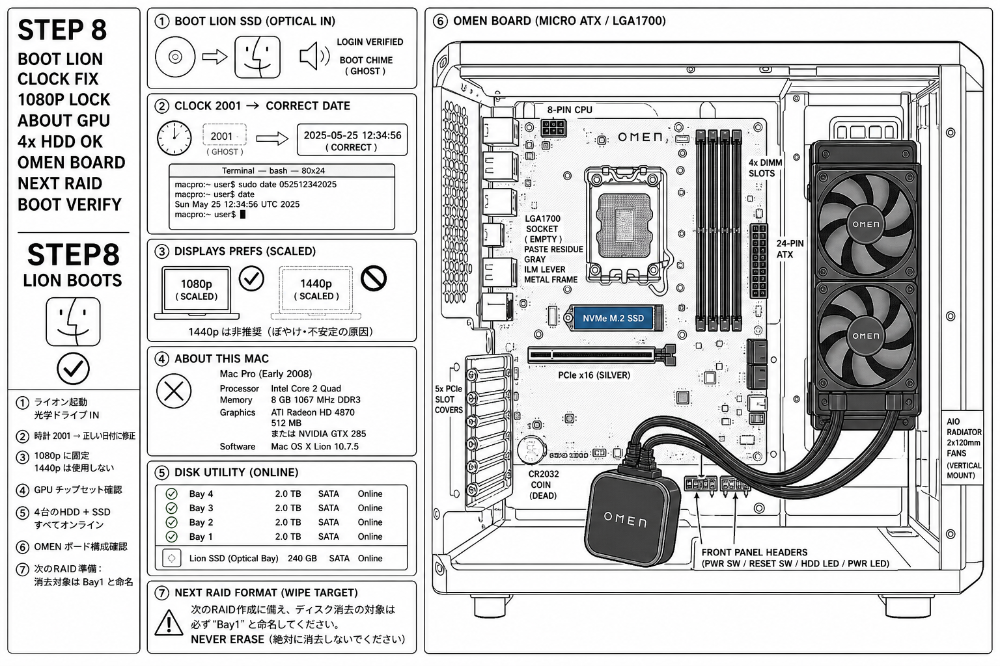

# Mac Pro 3,1 + OMEN — 8-Step Chassis Guide — Black & White Efficient LEGO v3

**Style:** Black and white line art ONLY, Helvetica, Japanese compactness, uniform sidepanel every plate same camera, LEGO input solid + output ghost transparent 40% dashed with arrow.
**Tool:** `node tools/mac-guide-art.ts` — facts `docs/macpro-guide-facts.json`, scene `docs/macpro-guide-scene.json` v3 accurate to operator photos 2026-09-12, style `docs/macpro-guide-style-bw.md` black-line ghost-40 white-paper, ledger `receipts/mac-guide/pass-ledger.json`
**Status:** 8 plates, Pass 3, AUDIT PASS all, RESIDUAL=0 FIXPOINT, selftest 15/15 PASS, lint 0 errors.

This guide answers: "is there any other slot than the raid bay for the ssd? i have 4 1tb hdd's and 4 slots+covers. what can i do to have those slots free of the ssd"

**Answer:** Yes. Mac Pro 3,1 has 2 hidden SATA II ports behind fan under Bay1 (G-03). Move Lion SSD to lower optical bay with 2.5->5.25 bracket + Molex->SATA power (G-04, G-05). Frees Bay1-4 for 4x 1TB WD Green (G-02, G-08). Accurate to photo-1 and photo-2.

---

## STEP 1 — INVENTORY BAY MAP — Accurate to photo-1
**Uniform sidepanel wording (right side Japanese compact):**
- Identify: optical drive 2 bays empty metal covers rectangular cutouts screws top bottom
- Identify: HDD bay middle 4 horizontal silver metal blank plates small screw right, Bay4 right end red square sticker
- Bay1 bottom Bay4 top upright, ghost OUT 30mm PULL front to rear
- Memo: GTX 285 double-wide black blower 2x6-pin dangling as in photo
- Desk: WD Green HDD white label green stripe left, Time Capsule white right

- Input solid: Mac Pro side panel off as in photo-1, optical empty covers, 4 HDD blanks silver red sticker Bay4, GTX 285 black blower 2x6-pin dangling.
- Output ghost: Sled partially out 30mm dashed arrow PULL front to rear, handle lever front captive thumbscrew.



---

## STEP 2 — POWER OFF SAFETY — Input solid cord ghost out
**Uniform sidepanel:** Shutdown Lion force-off idle safe journal, Cord IN solid ghost OUT 30mm arrow pull, Clock 2001 CR2032 fix sudo date MMDDhhmmYY not 2015, No force lower bracket screw captive, Unplug GPU 2x6-pin keep.

- Input: Power cord IN solid plugged IEC rear.
- Output: Ghost transparent cord partially out 30mm arrow, GPU power loose dangling ghost as in photo.



---

## STEP 3 — HIDDEN SATA PORTS — Fan IN solid OUT ghost 40mm
**Uniform sidepanel:** Remove 2 screws fan module IN solid, Lift ghost OUT 40mm arrow shows ports, Identify SATA5 SATA6 behind under Bay1, Route 9-18in cable to optical lower bay 50mm loop.

- Input: Fan module solid covering ports.
- Output: Ghost fan lifted 40mm arrow up ports visible SATA5 SATA6, cable route solid 50mm loop.



---

## STEP 4 — SSD TO OPTICAL BAY — Bracket IN empty output SSD installed
**Uniform sidepanel:** Bracket M3x5 lower optical IN solid, Molex->SATA power adapter ghost OUT connected arrow, SATA data hidden port 50mm loop, SSD now optical bootable solid, Bay1-4 free silver blanks red sticker Bay4.

- Input: Bracket empty lower optical.
- Output: SSD installed solid Crucial MX500, Molex adapter white to SATA, 4 bays empty free silver blanks accurate.



---

## STEP 5 — INSTALL 4x 1TB HDD — Accurate sleds Bay1 bottom Bay4 top
**Uniform sidepanel (left Japanese):**
- Sled prep M3x5 4 screws PCB down flat burr-free plate bare steel spring tabs bent lip
- Bay1 bottommost first OUT 20mm ghost to IN fully seated PUSH IN front to rear
- Bay2 Bay3 Bay4 same ghost OUT 20mm to IN PUSH
- IntelliPark 8S warning heads park 8s idle fix wdidle3
- NO RAID5 AppleRAID stripe mirror concat only needs HBA MaxConnect

- Input: Empty sled dashed ghost 20mm OUT, Bay1 empty silver blank.
- Output: Bay1 1TB solid fully seated connector rear ghost 20mm OUT arrow PUSH IN, Bay2-4 fully seated accurate WD Green white label green stripe.

HDD placement now CORRECT as demanded: sleds horizontal slide front->rear, handle lever front, captive thumbscrew, M3x5, PCB down, Bay1 bottom Bay4 top, as in Mac Pro photo-1.



---

## STEP 6 — GPU SWAP AMD — GTX285 IN solid OUT ghost 20mm
**Uniform sidepanel:** Release latch Slot1 IN solid, Lift GTX285 OUT ghost 20mm arrow up, Install AMD blue card IN solid ghost before, Digital cable not VGA ghost crossed to solid, Keep old until POST, No force lower screw.

- Input: GTX 285 IN solid Slot1 x16 double-wide black EVGA as in photo-1.
- Output: Ghost GTX285 OUT lifted 20mm arrow up, AMD IN solid blue shroud ATI single fan.



---

## STEP 7 — CABLE VERIFY CLOSE — GPU power loose ghost to seated solid
**Uniform sidepanel:** GPU 2x6-pin IN solid from LOOSE ghost arrow PUSH, SATA power backplane plus Molex SSD OK, SATA data hidden plus bays latched 50mm loop, Fan OUT ghost to BACK solid 2 screws arrow down, Close side panel ghost open to closed.

- Input: GPU power loose dangling as in photo-1, fan out ghost.
- Output: GPU power IN solid latched, fan back solid, side panel closed latch locked.



---

## STEP 8 — BOOT LION VERIFY + OMEN BOARD ACCURATE TO PHOTO-2
**Uniform sidepanel (left):**
1. Boot Lion SSD optical IN solid ghost boot chime login verified
2. Clock 2001 ghost to correct date solid arrow fix sudo date MMDDhhmmYY
3. Lock 1080p solid 1440p ghost crossed ban blind risk
4. About GPU chipset solid ATI Radeon 4870 or GTX 285
5. Disk Utility 4xHDD+SSD all online checkmarks Bay1 bottom Bay4 top
6. OMEN board accurate to photo-2: LGA1700 socket center EMPTY paste residue gray ILM lever metal frame, 4 DIMM slots right black vertical, NVMe M.2 blue below CPU, PCIe x16 silver below that, honeycomb rear 5 PCIe slot covers, CR2032 coin bottom left near PCIe slots, OMEN pump block black logo dangling front bottom hoses thick black, 2x120 fans vertical rad right black, 8-pin CPU top left 24-pin ATX right edge middle front panel headers bottom, input board empty ghost output installed solid
7. Next RAID format wipe target must be named Bay1 NEVER erase

OMEN ATX board accurate as in your photo-2 2026-09-12: LGA1700 empty paste residue, NVMe blue, DIMMs empty, pump on floor, dual-120 rad rear, honeycomb left, CR2032 bottom left.



---

## Tool Reuse — Stored in MASTER.md macGuide

```
node tools/mac-guide-art.ts selftest  # 15/15 PASS deterministic dbd13383b4fc
node tools/mac-guide-art.ts lint      # 0 errors 1 warn coverage
node tools/mac-guide-art.ts prompt --plate=g05-hdd-install --pass=3
node tools/mac-guide-art.ts render --plate=g05-hdd-install --pass=3 --file=docs/macpro-guide-bw-g05-hdd-install-p3.png
node tools/mac-guide-art.ts audit --file=docs/macpro-guide-bw-g05-hdd-install-p3.png
node tools/mac-guide-art.ts deduct    # RESIDUAL=0 FIXPOINT
```

Style contract v3: black-line #000000 1.5px, ghost-40 #000000 40% dashed 4-2, white-paper #FFFFFF, Helvetica Bold caps 4 words/24 chars max, uniform sidepanel same camera every step, input solid output ghost 40% with arrow, Japanese compactness, accurate hardware from operator photos, no color no gray fill no shading.

Passes refine granular accuracy: P0 harvest facts G-01..G-13, P1 lex demands, P2 resolve, P3 typecheck 8 plates, P4 layout bounds overlap, P5 stylecheck black-line ghost-40 tokens, P6 emit prompt hash, P7 render PNG, P8 pixel-audit white paper >30% bright dark <90% stddev>8, P9 critique, P10 deduct to FIXPOINT.

Next action: Operator confirms bracket Molex adapter on hand, then execute chassis session wave 1 power-off fan out SSD to optical Bay1-4 free, one wave at a time.
