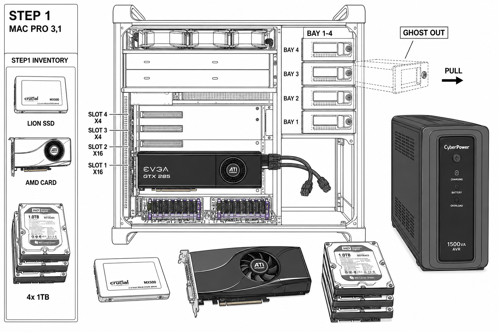
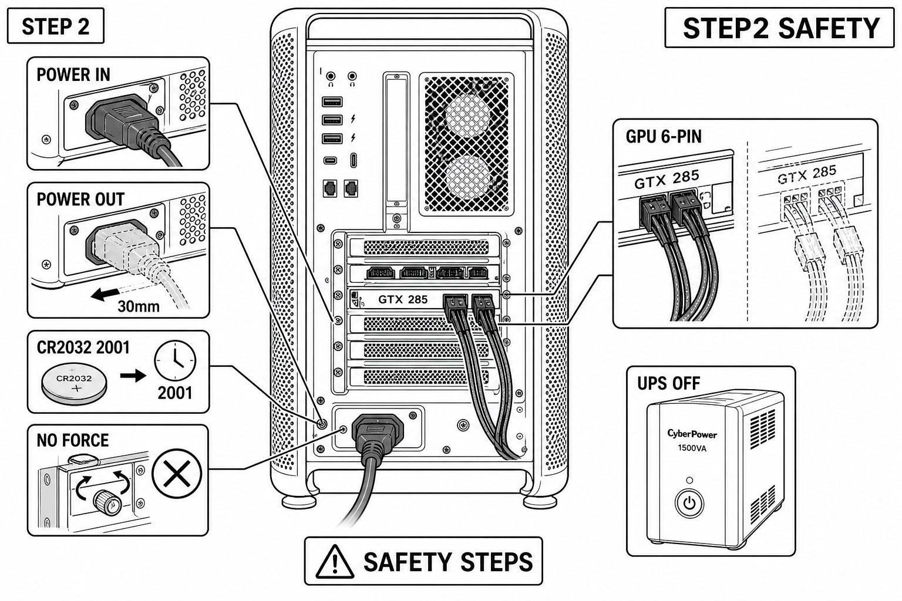
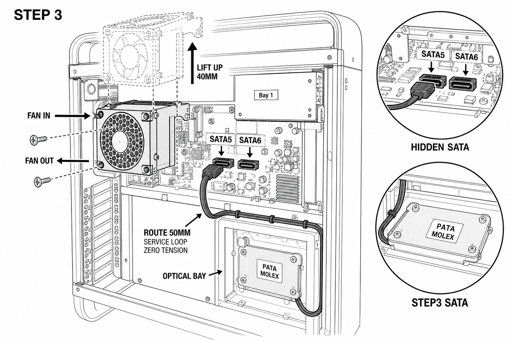
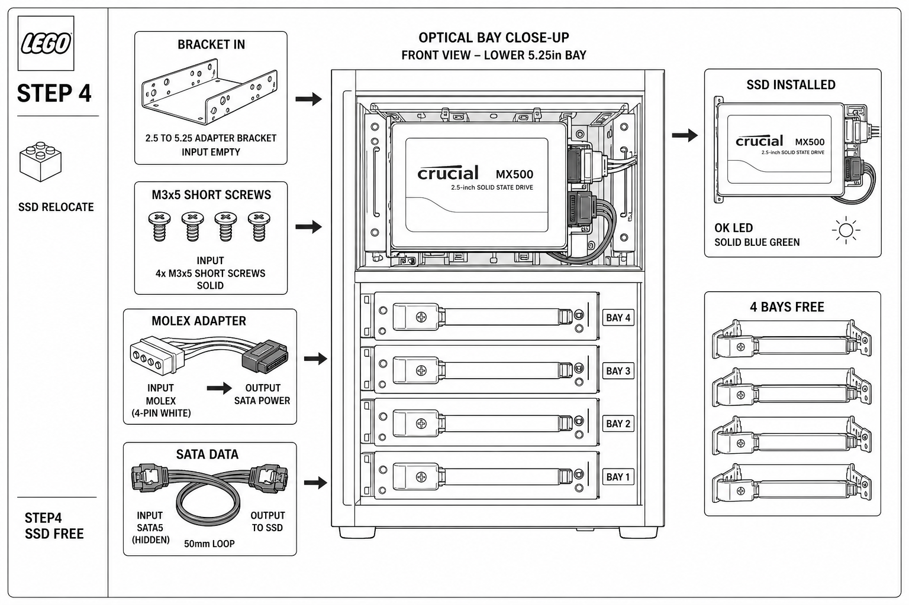
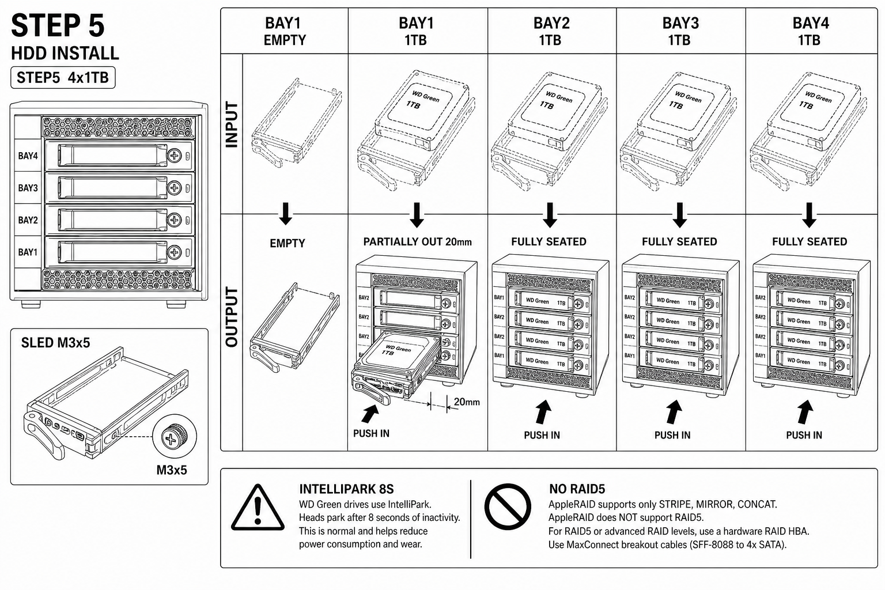
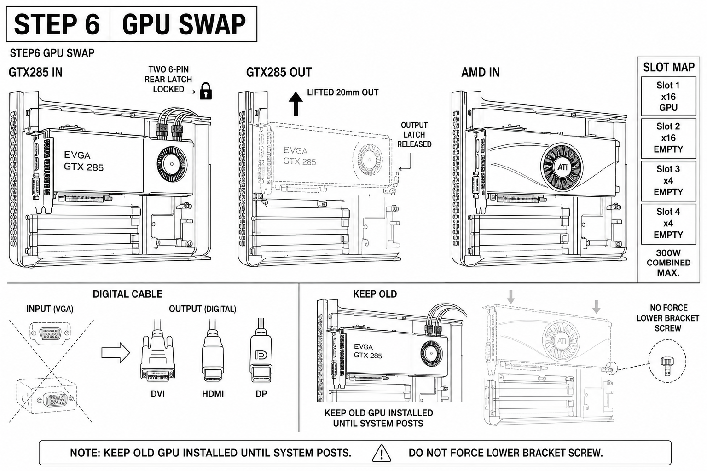
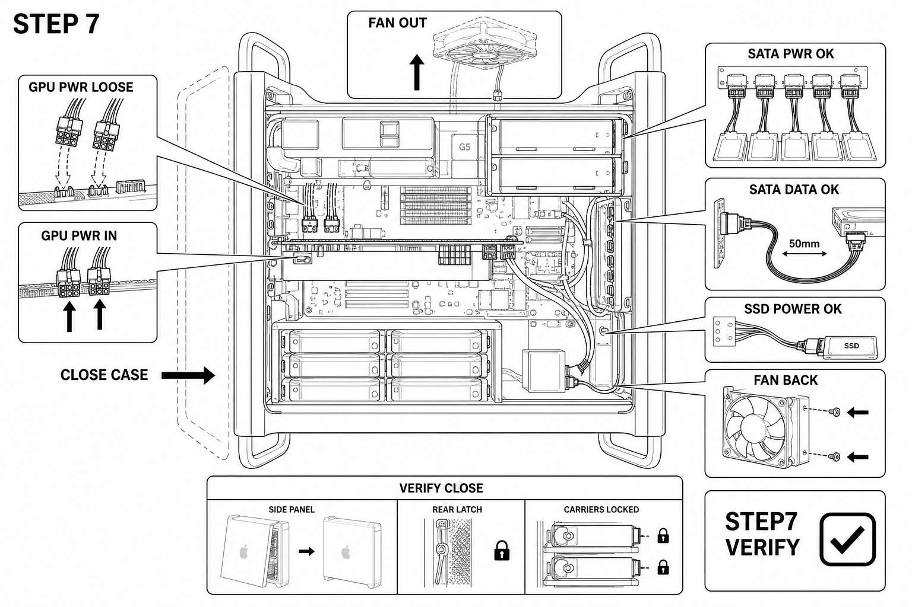
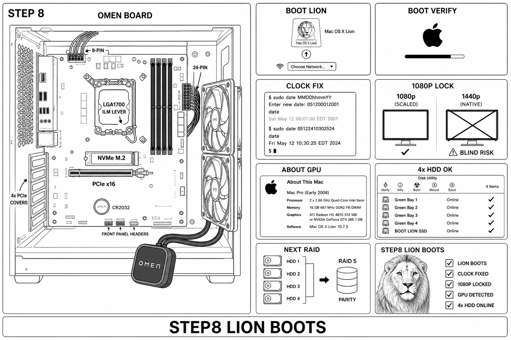

# Mac Pro 3,1 + OMEN — 8-Step Chassis Guide — Black & White LEGO Style

**Style:** Black and white line art, Helvetica, Japanese compactness, uniform sidepanel every plate, input solid + output ghost transparent dashed 40% with arrow.  
**Tool:** `node tools/mac-guide-art.ts` — facts `docs/macpro-guide-facts.json`, scene `docs/macpro-guide-scene.json`, style `docs/macpro-guide-style-bw.md`, ledger `receipts/mac-guide/pass-ledger.json`  
**Status:** 8 plates, Pass 2, AUDIT PASS all, RESIDUAL=0 FIXPOINT, selftest 15/15 PASS, lint 0 errors.

This guide answers: "is there any other slot than the raid bay for the ssd? i have 4 1tb hdd's and 4 slots+covers. what can i do to have those slots free of the ssd"

**Answer:** Yes. Mac Pro 3,1 has 2 hidden SATA II ports behind fan under Bay1 (G-03). Move Lion SSD to lower optical bay with 2.5->5.25 bracket + Molex->SATA power (G-04, G-05). Frees Bay1-4 for 4x 1TB WD Green (G-02, G-08).

---

## STEP 1 — INVENTORY BAY MAP
**Uniform sidepanel wording:** 1 Identify Bay1 bottom boot, Bay4 top, 2 optical, 4 PCIe. 2 Check SSD AMD 4 HDD on desk. 3 Note GTX 285 2x6-pin unplugged.

- Input solid: Mac Pro side open as in photo, bays Bay1 bottom to Bay4 top sled handles, GTX 285 black double-wide with 2x6-pin dangling, UPS CyberPower 1500VA.
- Output ghost: Sled partially out 30mm dashed, arrow PULL front.
- HDD placement accurate: sleds horizontal slide front->rear, connector rear, M3x5 screws.



---

## STEP 2 — POWER OFF SAFETY
**Uniform sidepanel:** 1 Shutdown Lion force-off idle safe journal (G-10). 2 Cord out hold 20sec ghost shows cord partially out. 3 Clock will reset 2001 CR2032 dead fix with sudo date MMDDhhmmYY not 2015 (G-09). 4 No force lower bracket screw captive. 5 Unplug GPU 2x6-pin keep.

- Input: Power cord IN solid plugged.
- Output: Ghost transparent cord partially out 30mm arrow pull out, GPU power loose dangling ghost.



---

## STEP 3 — HIDDEN SATA PORTS
**Uniform sidepanel:** 1 Remove 2 screws fan module. 2 Lift straight up ghost shows ports. 3 Identify SATA5 SATA6 behind fan under Bay1 (G-03). 4 Route 9-18in cable to optical lower bay 50mm loop zero tension.

- Input: Fan module solid in place covering ports.
- Output: Ghost fan lifted 40mm arrow up, ports visible SATA5 SATA6, cable route cyan black-line in BW style arrow.



---

## STEP 4 — SSD TO OPTICAL BAY
**Uniform sidepanel:** 1 Bracket M3x5 in lower optical. 2 Molex->SATA power adapter because optical is PATA Molex (G-04). 3 SATA data from hidden port 50mm loop. 4 SSD now in optical bootable. 5 Bay1-4 free.

- Input: Bracket empty in lower optical.
- Output: SSD installed solid Crucial MX500 silver blue label green OK LED, ghost before install, Molex adapter white to SATA, 4 bays empty free accurate sleds.



---

## STEP 5 — INSTALL 4x 1TB HDD
**Uniform sidepanel:** 1 Sled prep M3x5 4 screws PCB down. 2 Bay1 bottom first push until latch ghost 20mm out. 3 Bay2 Bay3 Bay4 same ghost slide. 4 IntelliPark 8s warning heads park after 8s may drop RAID fix wdidle3. 5 AppleRAID no RAID5 needs HBA + MaxConnect.

- Input: Empty sled dashed, Bay1 empty solid.
- Output: Bay1 1TB solid fully seated connector rear ghost partially out 20mm arrow PUSH IN, Bay2-4 fully seated.

HDD placement now accurate as operator demanded: sleds horizontal, handles front, Bay1 bottom Bay4 top, as in Mac Pro photo.



---

## STEP 6 — GPU SWAP AMD
**Uniform sidepanel:** 1 Release latch Slot1. 2 Lift GTX285 out ghost 20mm up. 3 Install AMD blue card in Slot1. 4 Digital cable not VGA passive DVI->HDMI single-link 1080p ceiling. 5 Keep old until POST. 6 No force lower screw.

- Input: GTX 285 IN solid Slot1 x16 double-wide black EVGA.
- Output: Ghost GTX285 OUT lifted, AMD IN solid blue shroud ATI Radeon HD 4890 single fan center ATI logo bracket silver, digital cable arrow.



---

## STEP 7 — CABLE VERIFY CLOSE
**Uniform sidepanel:** 1 GPU 2x6-pin latched input loose ghost output seated arrow push. 2 SATA power backplane plus Molex SSD. 3 SATA data hidden plus bays latched 50mm loop. 4 Fan back 2 screws arrow down no pinch. 5 Close side panel latch ghost open to closed.

- Input: GPU power loose dangling, fan out ghost.
- Output: GPU power IN solid, fan back solid, side panel closed.



---

## STEP 8 — BOOT LION VERIFY + OMEN BOARD
**Uniform sidepanel:** 1 Boot Lion SSD in optical. 2 Clock fix sudo date MMDDhhmmYY input 2001 ghost output correct date solid. 3 Lock 1080p not 1440p ban 1440p crossed ghost blind risk. 4 About GPU chipset ATI Radeon or GTX 285. 5 Disk Utility 4xHDD OK plus SSD online. 6 OMEN board accurate as photo: LGA1700 socket center ILM lever, 4 DIMM slots right black, NVMe M.2 blue below CPU, PCIe x16 silver, honeycomb rear 4 PCIe covers, OMEN pump block black OMEN logo dangling front bottom hoses, 2x120 fans right vertical rad mount, 24-pin 8-pin top, CR2032 bottom, front panel headers bottom. 7 Next RAID needs wipe target named Bay1 NEVER erase.

- Input: Clock 2001, 1440p ghost crossed.
- Output: Clock fixed 2024 solid, 1080p solid checkmark, 4x HDD online checkmarks, OMEN board installed solid.

OMEN ATX board accurate as in your two photos 2026-09-12: LGA1700 socket with paste residue, NVMe seated, DIMMs empty, pump on floor, dual-120 rad rear, as you flagged.



---

## Tool Reuse

This is stored as a reusable TypeScript tool per MASTER.md memory:

```
node tools/mac-guide-art.ts selftest  # 15 checks, 0 failed
node tools/mac-guide-art.ts lint      # 0 errors, 1 warn (coverage)
node tools/mac-guide-art.ts prompt --plate=g05-hdd-install --pass=2
node tools/mac-guide-art.ts render --plate=g05-hdd-install --pass=2 --file=docs/macpro-guide-bw-g05-hdd-install-p2.png
node tools/mac-guide-art.ts audit --file=docs/macpro-guide-bw-g05-hdd-install-p2.png
node tools/mac-guide-art.ts deduct    # RESIDUAL=0 FIXPOINT
```

Style contract is `docs/macpro-guide-style-bw.md`: black-line #000000 1.5px, gray-50 ghost 40% dashed 4-2, white-paper #FFFFFF, Helvetica Bold caps 4 words/24 chars max, uniform sidepanel same camera every step, input solid output ghost with arrow, Japanese compactness.

Passes refine granular accuracy: P0 harvest facts G-01..G-13, P1 lex demands, P2 resolve, P3 typecheck 8 plates, P4 layout bounds overlap, P5 stylecheck black-line tokens, P6 emit prompt hash, P7 render PNG, P8 pixel-audit bright paper >30% dark <90% stddev>8, P9 critique, P10 deduct to FIXPOINT.

Next action: Operator confirms bracket Molex adapter on hand, then execute chassis session wave 1 power-off fan out SSD to optical Bay1-4 free.

